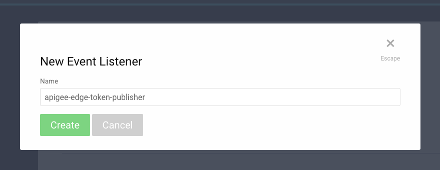
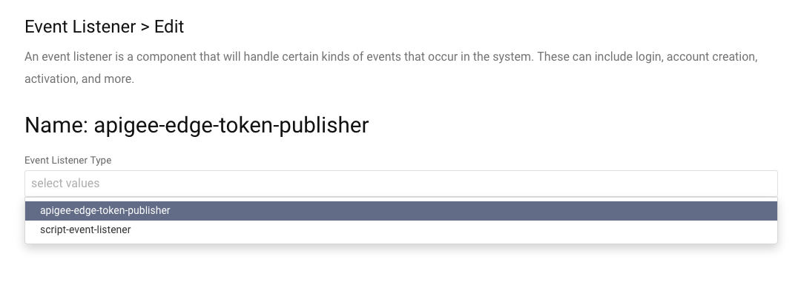
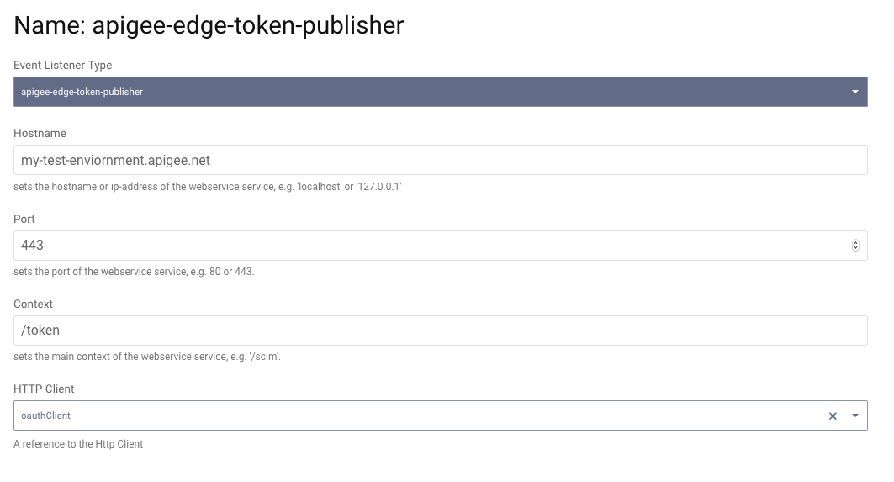

# Apigee Edge Token Publisher Demo Plugin

This is an example event listener SDK Plugin for the Curity Identity Server. The plugin registers an event listener 
listening for issued access token events, and forwards them to Apigee Edge. See the tutorial on 
[Integrating Apigee with Curity](https://developer.curity.io/tutorials/apigee-integration) for the full story on how 
Apigee Edge might be integrated with Curity.

## Building, installation and configuration

To build the plugin, simply download it and run `mvn package`. This creates the directory structure
`usr/share/plugins/apigee_edge_token_publisher` in the `target` directory which you can copy right into your `idsvr`
installation. Start the server and configure a new event listener (shown here using the Admin UI, but might just as well
be configured through the CLI, REST or XML):

Pick a suitable name and then select the "apigee-edge-token-publisher" type:

Configure your listener to point to your Apigee Edge endpoint:

Please visit [curity.io](https://curity.io/) for more information about the Curity Identity Server.